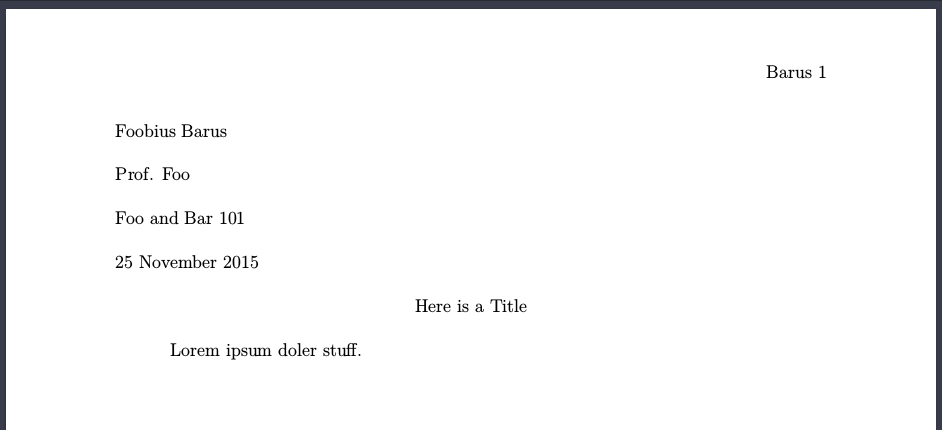

# MD2MLA

This script turns a markdown file in the form: 

```md
%Here is a Title

Lorem ipsum doler stuff.
```

Into an [MLA-style paper](https://owl.english.purdue.edu/owl/resource/747/13/i) in PDF format that looks like this: 

 

# Usage

First, edit `mla-template.tex` and enter your first name, last name, professor's name, and course name. Then run this command: 

```bash
./md2mla my-paper.md
```

If all goes well, this should generate my-paper.md.pdf. If it doesn't, maybe you need pandoc or xelatex? 

# Requirements
This script requires pandoc and xelatex. On Ubuntu and Debian, you can probably just run: `sudo apt-get install pandoc texlive-xetex`.

# About
This uses a modified version of the [mla13.sty style](https://github.com/jackson13info/mla13). Check out the documentation there if you want to add a Works Cited page. Works Cited pages aren't really implemented here at the moment, but would be easy to add with pandoc-citeproc and a bibtex file for your cited works. Just make sure you have pandoc-citeproc installed (`sudo apt-get install pandoc-citeproc`), and add `--filter pandoc-citeproc` to the script. 
